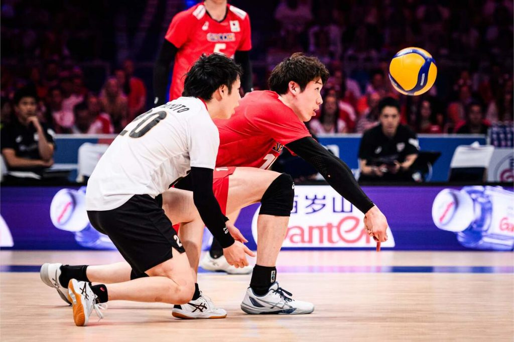

<div align="center">

# SetStream 🏐

### *Production-Grade Volleyball Analytics Pipeline*

[](https://github.com/YahyaMansoub/SetStream/actions)
[](https://hub.docker.com)
[](https://www.r-project.org/)
[](LICENSE)



*End-to-end data pipeline for international volleyball data from FIVB VIS*

[Quick Start](#quick-start) • [Features](#features) • [Architecture](#architecture) • [API Docs](#api-endpoints) • [Dashboard](#dashboard-tabs)

---

</div>

**SetStream** ingests, processes, and analyzes international volleyball data from FIVB VIS (Volleyball Information System). Built entirely in R with modern data engineering practices, featuring automated pipelines, Elo ratings, upset detection, and interactive analytics.

## Project Structure

```
setstream/
├── R/                      # Core pipeline modules
├── sql/marts/              # SQL mart definitions
├── api/                    # REST API (Plumber)
├── dashboard/              # Shiny dashboard
├── scripts/                # Execution scripts
├── tests/                  # Test suite
├── data/
│   ├── lake/               # Parquet data lake
│   ├── warehouse/          # DuckDB warehouse
│   └── state/              # Pipeline state
├── _targets.R              # Pipeline orchestration
└── config.yml              # Configuration
```

## Quick Start

### Option 1: Docker (Recommended)

```bash
# Build and start all services
docker-compose up -d

# Run the pipeline
docker-compose exec pipeline make run

# View logs
docker-compose logs -f

# Access services:
# - API: http://localhost:8000
# - Dashboard: http://localhost:3838
```

### Option 2: Local Development

```bash
# 1. Bootstrap environment (first time only)
make bootstrap

# 2. Run the pipeline
make run

# 3. Start API (separate terminal)
make api

# 4. Launch dashboard (separate terminal)
make dashboard
```

## 🏗️ Architecture

SetStream follows a layered ELT architecture with clear separation of concerns:

```
📡 FIVB VIS API
    ↓
🔄 [Extract Layer] ← Rate limiting, retries, caching
    ↓
💾 [Data Lake] ← Parquet, partitioned (Season/Year)
    ↓
🗄️  [DuckDB Warehouse] ← Staging tables, upserts
    ↓
✅ [Quality Checks] ← Schema, uniqueness, referential integrity
    ↓
📊 [Marts] ← Team form, Elo ratings, upsets, rankings
    ↓
🚀 [API + Dashboard] ← Analytics interface
```

## Tech Stack

- **Language:** R (primary), SQL
- **Data Source:** `fivbvis` package (openvolley)
- **Storage:** Parquet (lake) + DuckDB (warehouse)
- **Orchestration:** `targets` (functional DAG)
- **Quality:** `pointblank` (validation framework)
- **API:** `plumber` (REST)
- **Dashboard:** Shiny
- **Testing:** `testthat`
- **Logging:** `logger`
- **Containers:** Docker + Docker Compose
- **CI/CD:** GitHub Actions

## Features

✅ **Fully Automated:** No manual data entry  
✅ **Incremental Loads:** Only fetch new data  
✅ **Idempotent:** Safe to rerun  
✅ **Data Quality:** Comprehensive validation  
✅ **Elo Ratings:** Team strength evolution  
✅ **Upset Detection:** Surprising match outcomes  
✅ **Production-Ready:** Logging, retries, error handling

## Data Model

### Staging Layer
- `stg_tournaments` - Tournament metadata
- `stg_matches` - Match results
- `stg_match_details` - Detailed match statistics
- `stg_tournament_rankings` - Final rankings

### Mart Layer
- `mart_team_form` - Recent W/L, streaks
- `mart_team_elo_history` - Elo rating evolution
- `mart_upsets` - Underdog victories
- `mart_tournament_rankings` - Tournament results

## API Endpoints

- `GET /health` - Service status
- `GET /teams/top?limit=20` - Top teams by Elo
- `GET /teams/{team}/elo` - Team Elo history
- `GET /tournaments/recent` - Recent tournaments
- `GET /upsets/recent?days=30` - Recent upsets

## Dashboard Tabs

1. **Top Teams** - Elo leaderboard
2. **Team Detail** - Team profile & history
3. **Upsets** - Surprising results
4. **Pipeline** - Monitoring & stats

## Configuration

Edit `config.yml` for:
- Rolling window days (default: 365)
- Rate limiting (default: 1 req/sec)
- API port (default: 8000)
- Dashboard port (default: 3838)

## Respectful Usage

⚠️ This project respects FIVB VIS API with:
- Rate limiting (1 req/sec default)
- Local caching (avoid refetches)
- Incremental loads (minimal requests)
- Poocker Deployment

### Production Deployment

```bash
# Quick deploy (uses deploy.sh)
./deploy.sh

# Or manually:
docker-compose -f docker-compose.yml up -d

# Check service health
docker-compose ps

# Scale services (if needed)
docker-compose up -d --scale api=3

# Stop services
docker-compose down
```

### CI/CD Pipeline

The project includes a GitHub Actions workflow (`.github/workflows/ci-cd.yml`) that:

✅ Runs tests on multiple R versions  
✅ Builds Docker images  
✅ Performs security scans  
✅ Pushes images to GitHub Container Registry  
✅ Deploys to production (configurable)

**Required GitHub Secrets:**
- `GITHUB_TOKEN` (automatically provided)

### Available Docker Images

- `production` - Full pipeline runner
- `api` - REST API service
- `dashboard` - Shiny dashboard

## Development

```bash
# Run tests
make test

# Clean data (reset)
make clean

# View pipeline graph
Rscript -e "targets::tar_visnetwork()"

# Docker development
docker-compose build
docker-compose run --rm pipeline make test
# View pipeline graph
Rscript -e "targets::tar_visnetwork()"
```

## Troubleshooting

**Issue:** `fivbvis` functions fail  
**Solution:** Check internet connection, verify API availability

**Issue:** DuckDB locked  
**Solution:** Close all R sessions, delete `.duckdb.wal` file

**Issue:** Out of memory  
**Solution:** Reduce `rolling_window_days` in config.yml

## License

                                                                                                                                                                                                                                                                                                    بدون

## Acknowledgments

- [openvolley/fivbvis](https://github.com/openvolley/fivbvis) - Data access
- FIVB VIS - Data source

---

*Built with ❤️ for volleyball analytics*
